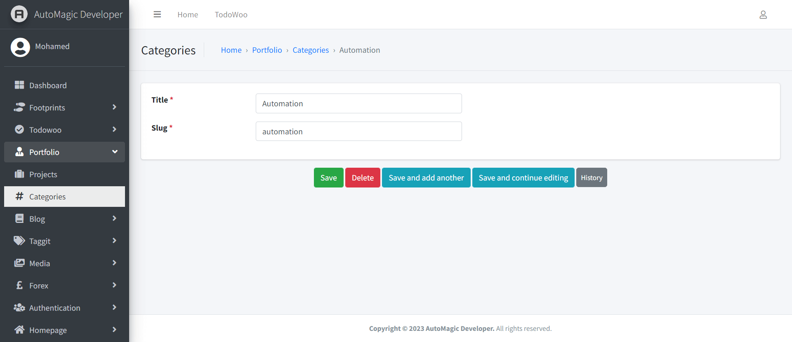

<!-- PROJECT SHIELDS -->
<!--
*** I'm using markdown "reference style" links for readability.
*** Reference links are enclosed in brackets [ ] instead of parentheses ( ).
*** See the bottom of this document for the declaration of the reference variables
*** for contributors-url, forks-url, etc. This is an optional, concise syntax you may use.
*** https://www.markdownguide.org/basic-syntax/#reference-style-links
-->

[![LinkedIn][linkedin-shield]][linkedin-url]

<!-- PROJECT LOGO -->
 

    

  <h3 align="center">Personal Portfolio Web Application</h3>

<!-- TABLE OF CONTENTS -->

  
Table of Contents

  <ol>
    <li>
      <a href="#about-the-project">About The Project</a>
      <ul>
        <li><a href="#built-with">Built With</a></li>
      </ul>
    </li>
    <li><a href="#usage">Usage</a></li>
    <li><a href="#license">License</a></li>
    <li><a href="#contact">Contact</a></li>
  </ol>

<!-- ABOUT THE PROJECT -->
## About The Project

* Project Name: Personal Portfolio Web Application
* Version: v1.0.0

### Description

A personal portfolio web application that I developed using Django. It is a platform 
where individuals can showcase their work, skills, and achievements. 

Here are some key features of this application:

* Portfolio showcase: The portfolio showcase is the main feature of the 
application. It is where the user can display their work samples, 
including images, videos, and links to external projects. 
The portfolio showcase can be organized into categories for easy navigation.

* Admin panel: The admin panel is where the user can manage the content of their 
application, including adding, updating or deleting portfolio items.

* Responsive design: The application have a responsive design that adapts to 
different screen sizes and devices, making it easy for users to view the 
portfolio on desktop and mobile.

* Deployment: The application is deployed on a cloud server for others to 
access it online. It can be hosted on platforms like Heroku, AWS, or 
Digital Ocean.

Overall, This personal portfolio web application developed using Django offers 
a user-friendly platform for individuals to showcase their skills and 
accomplishments. It can also be customized to meet the user's specific needs 
and preferences.

(<a href="#readme-top">back to top</a>)

### Built With

This project was developed using the following tech stacks:

* Python
* Django Backend Framework
* HTML
* CSS
* Bootstrap

(<a href="#readme-top">back to top</a>)

<!-- USAGE EXAMPLES -->
## Usage

### Screenshots

#### Add Project

#### Add Category

#### Project Page

(<a href="#readme-top">back to top</a>)

<!-- LICENSE -->
## License

Distributed under the MIT License. See `LICENSE.txt` for more information.

(<a href="#readme-top">back to top</a>)

<!-- CONTACT -->
## Contact

Mohamed AbdelGawad Ibrahim - [@m-abdelgawad](https://www.linkedin.com/in/m-abdelgawad/) - <a href="tel:+201069052620">+201069052620</a> - muhammadabdelgawwad@gmail.com

GitHub Profile Link: [https://github.com/m-abdelgawad](https://github.com/m-abdelgawad)

(<a href="#readme-top">back to top</a>)

<!-- MARKDOWN LINKS & IMAGES -->
<!-- https://www.markdownguide.org/basic-syntax/#reference-style-links -->
[linkedin-shield]: https://img.shields.io/badge/-LinkedIn-black.svg?style=for-the-badge&logo=linkedin&colorB=555
[linkedin-url]: https://www.linkedin.com/in/m-abdelgawad/
